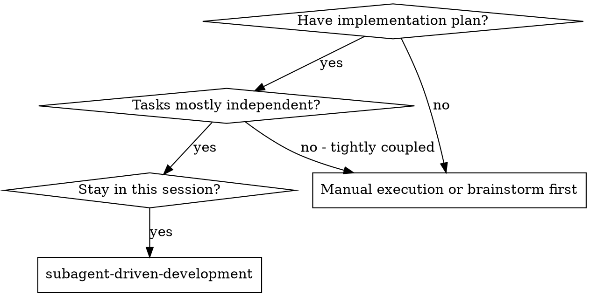
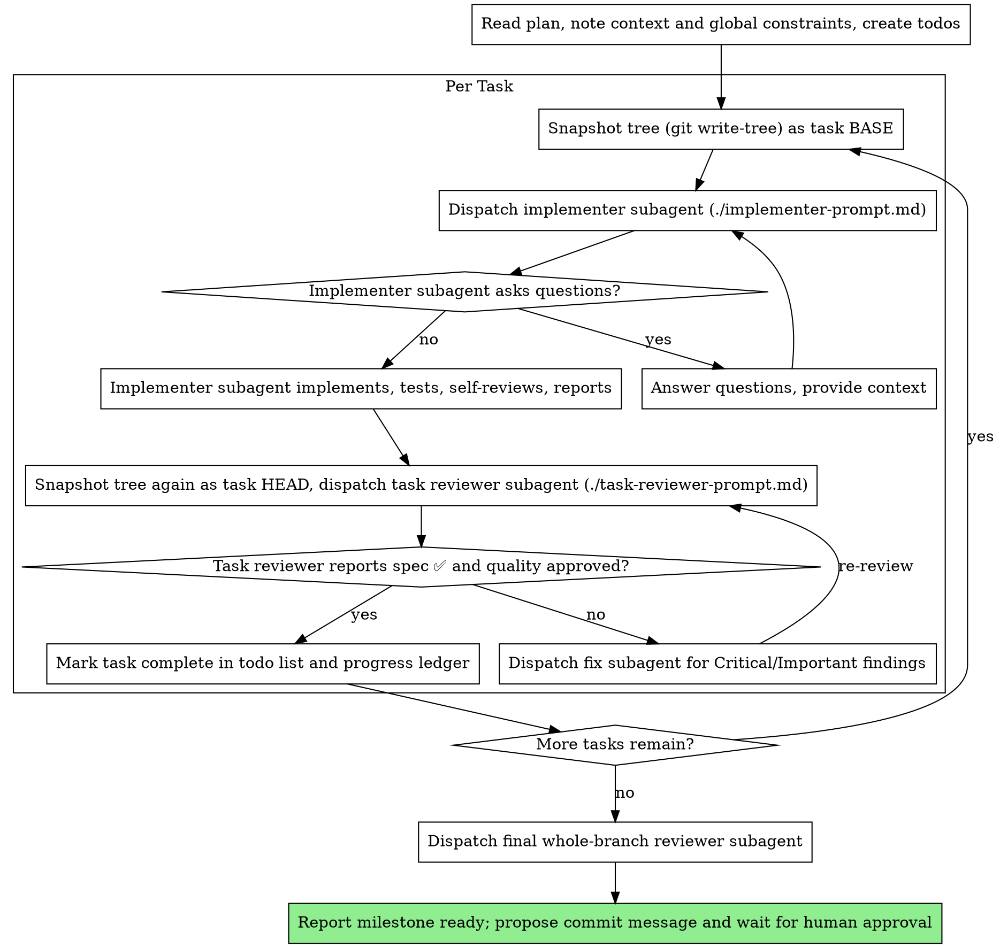

# Subagent-Driven Development

Execute plan by dispatching a fresh implementer subagent per task, a task review (spec compliance + code quality) after each, and a broad whole-branch review at the end.

**Why subagents:** You delegate tasks to specialized agents with isolated context. By precisely crafting their instructions and context, you ensure they stay focused and succeed at their task. They should never inherit your session's context or history — you construct exactly what they need. This also preserves your own context for coordination work.

**Core principle:** Fresh subagent per task + task review (spec + quality) + broad final review = high quality, fast iteration

**Narration:** between tool calls, narrate at most one short line — the
ledger and the tool results carry the record.

**Continuous execution:** Do not pause to check in with your human partner between tasks. Execute all tasks from the plan without stopping. The only reasons to stop are: BLOCKED status you cannot resolve, ambiguity that genuinely prevents progress, or all tasks complete. "Should I continue?" prompts and progress summaries waste their time — they asked you to execute the plan, so execute it.

## No-Commit Rule (overrides any per-task-commit pattern)

This project commits at feature/milestone boundaries with explicit human
approval — never per task, per step, or per TDD cycle. This changes how
review works compared to a commit-per-task workflow:

- **Dispatched implementer subagents NEVER run `git` and NEVER commit.**
  They implement, test, and report only. A subagent that proposes to commit
  has misunderstood its brief — correct it and re-dispatch if needed.
- **The controller (you) does not commit per task either.** Commits happen
  only at a milestone, with explicit human approval, after all tasks in the
  plan are done and reviewed.
- Because there are no per-task commits to diff between, the review
  baseline is a **git tree snapshot** taken with `git write-tree` before
  each task (no commit object, no ref, no working-tree mutation — it just
  writes the current index as a tree object and prints its SHA). Each
  task's review diff is computed against the previous snapshot tree:
  `git diff <previous-tree-sha> <current-tree-sha>`. This is exactly the
  mechanism used to build this very feature — every task in this plan was
  snapshotted with `write-tree` and reviewed via tree-to-tree diff, not
  commit-to-commit diff.
- Before dispatching Task 1, take the baseline snapshot: `git add -A && git
  write-tree` (this requires the changes to be staged so the tree reflects
  them; if you don't want to disturb the working tree's stage, use a
  temporary `GIT_INDEX_FILE` pointed at a scratch index instead). Record the
  printed tree SHA as `BASE`.
- After each task, stage again and snapshot again to get `HEAD` for that
  task's review. After review passes, `HEAD` becomes `BASE` for the next
  task.
- At the end of all tasks, the final whole-branch review diffs the
  milestone's starting tree snapshot against the last task's tree snapshot
  — still no commits involved.

## When to Use

- Fresh subagent per task (no context pollution)
- Review after each task (spec compliance + code quality), broad review at the end
- Faster iteration (no human-in-loop between tasks)

## The Process

## Pre-Flight Plan Review

Before dispatching Task 1, scan the plan once for conflicts:

- tasks that contradict each other or the plan's Global Constraints
- anything the plan explicitly mandates that the review rubric treats as a
  defect (a test that asserts nothing, verbatim duplication of a logic block)

Present everything you find to your human partner as one batched question —
each finding beside the plan text that mandates it, asking which governs —
before execution begins, not one interrupt per discovery mid-plan. If the
scan is clean, proceed without comment. The review loop remains the net for
conflicts that only emerge from implementation.

## Model Selection

Use the least powerful model that can handle each role to conserve cost and increase speed.

**Mechanical implementation tasks** (isolated functions, clear specs, 1-2 files): use a fast, cheap model. Most implementation tasks are mechanical when the plan is well-specified.

**Integration and judgment tasks** (multi-file coordination, pattern matching, debugging): use a standard model.

**Architecture and design tasks**: use the most capable available model.
The final whole-branch review is one of these — dispatch it on the most
capable available model, not the session default.

**Review tasks**: choose the model with the same judgment, scaled to the
diff's size, complexity, and risk. A small mechanical diff does not need the
most capable model; a subtle concurrency change does.

**Always specify the model explicitly when dispatching a subagent.** An
omitted model inherits your session's model — often the most capable and
most expensive — which silently defeats this section.

**Turn count beats token price.** Wall-clock and context cost scale with how
many turns a subagent takes, and the cheapest models routinely take 2-3× the
turns on multi-step work — costing more overall. Use a mid-tier model as the
floor for reviewers and for implementers working from prose descriptions.
When the task's plan text contains the complete code to write, the
implementation is transcription plus testing: use the cheapest tier for
that implementer. Single-file mechanical fixes also take the cheapest tier.

**Task complexity signals (implementation tasks):**
- Touches 1-2 files with a complete spec → cheap model
- Touches multiple files with integration concerns → standard model
- Requires design judgment or broad codebase understanding → most capable model

## Handling Implementer Status

Implementer subagents report one of four statuses. Handle each appropriately:

**DONE:** Snapshot the tree (`git add -A && git write-tree`) to get this
task's HEAD, then dispatch the task reviewer with the previous task's tree
SHA as BASE and this snapshot as HEAD — never reuse an older snapshot,
which silently drops work from prior tasks in the diff.

**DONE_WITH_CONCERNS:** The implementer completed the work but flagged doubts. Read the concerns before proceeding. If the concerns are about correctness or scope, address them before review. If they're observations (e.g., "this file is getting large"), note them and proceed to review.

**NEEDS_CONTEXT:** The implementer needs information that wasn't provided. Provide the missing context and re-dispatch.

**BLOCKED:** The implementer cannot complete the task. Assess the blocker:
1. If it's a context problem, provide more context and re-dispatch with the same model
2. If the task requires more reasoning, re-dispatch with a more capable model
3. If the task is too large, break it into smaller pieces
4. If the plan itself is wrong, escalate to the human

**Never** ignore an escalation or force the same model to retry without changes. If the implementer said it's stuck, something needs to change.

## Handling Reviewer ⚠️ Items

The task reviewer may report "⚠️ Cannot verify from diff" items — requirements
that live in unchanged code or span tasks. These do not block the rest of the
review, but you must resolve each one yourself before marking the task
complete: you hold the plan and cross-task context the reviewer
lacks. If you confirm an item is a real gap, treat it as a failed spec
review — send it back to the implementer and re-review.

## Dispatch mechanics

Full rules for constructing reviewer prompts, handing artifacts as files, and
durable progress live in **[references/dispatch-mechanics.md](references/dispatch-mechanics.md)** — read it before your first dispatch. The non-negotiables it expands on:

- **Hand artifacts as FILES, never pasted into the prompt** (task brief, tree-diff
  package, report file). Pasted text stays resident in your context and is
  re-read every later turn — a real dispatch hit 42k chars of 99% pasted history.
- **A dispatch prompt describes ONE task** — its brief path, the interfaces it
  touches, the global constraints. Never paste prior-task summaries.
- **Copy the plan's Global Constraints verbatim** into the reviewer's prompt as
  its attention lens; never tell a reviewer what not to flag or pre-rate a
  finding's severity.
- **Dispatch ONE fix subagent per review** with the full findings list, not one
  fixer per finding.
- **Track completed tasks in a ledger** (`specs/<feature>/progress.md`) with the
  `write-tree` SHAs. After compaction, trust the ledger — NEVER re-dispatch a
  task it marks complete.

## Prompt Templates

- [implementer-prompt.md](implementer-prompt.md) - Dispatch implementer subagent
- [task-reviewer-prompt.md](task-reviewer-prompt.md) - Dispatch task reviewer subagent (spec compliance + code quality)
- Final whole-branch review: build the same kind of prompt inline — full
  milestone tree-diff package, global constraints, spec-compliance plus
  code-quality rubric exactly as in task-reviewer-prompt.md, scoped to the
  whole milestone instead of one task.

## Hard rules

The critical "never"s — full catalog, plus why-this-beats-manual and how to react
when a subagent asks questions / a reviewer finds issues / a task fails, in
**[references/troubleshooting.md](references/troubleshooting.md)**. A worked
end-to-end trace is in **[references/example-workflow.md](references/example-workflow.md)**.

- Never start on main/master without explicit user consent.
- Never let an implementer or fix subagent run `git commit` (or any git mutation)
  — they implement, test, report only. The controller commits only at a milestone,
  with human approval.
- Never dispatch multiple implementation subagents in parallel (they conflict).
- Never skip task review or accept a report missing either verdict (spec
  compliance AND code quality are both required); never move to the next task
  with open Critical/Important findings.
- Never re-dispatch a task the ledger already marks complete.

## Integration

**Required workflow skills:**
- **using-git-worktrees** - Ensures isolated workspace (creates one or verifies existing), if the human wants isolation for this milestone

**Subagents MUST use:**
- The `test-driven-development` skill (red-green-refactor) for every task —
  REQUIRED, not optional. Iron Law: no production code without a failing test
  first; test BEHAVIOR, never implementation details or mocks. Each implementer
  dispatch must instruct the subagent to follow it; a report that shows code
  written before its test (or tests that assert on mocks) is a failed task
  review — send it back.
