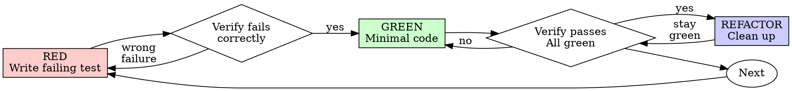

# Test-Driven Development (TDD)

## Overview

Write the test first. Watch it fail. Write minimal code to pass.

**Core principle:** If you didn't watch the test fail, you don't know if it tests the right thing.

**Violating the letter of the rules is violating the spirit of the rules.**

This is a REQUIRED step in the keel SDD flow — `implement-feature` and any
subagent writing production code MUST follow this cycle. It is not optional and
not "test-after".

## Behavior, Not Implementation

Test WHAT the code does, never HOW it does it. A test is a contract about
observable behavior; it must survive any refactor that preserves that behavior.

- **Assert on outcomes, not internals.** Inputs → observable outputs / state /
  effects. Never assert on private fields, call order of internal helpers, or
  the shape of intermediate values.
- **Never test a mock.** Mocks isolate; they are not the thing under test. If a
  test passes only because a mock is present, it proves nothing. Prefer real
  collaborators; mock only the genuinely slow/external edge, and assert on the
  real behavior that results — see [testing-anti-patterns.md](testing-anti-patterns.md).
- **The refactor test:** could you rewrite the implementation from scratch,
  keeping the same behavior, and have every test still pass? If a test breaks
  on a behavior-preserving refactor, it is testing implementation — rewrite it.
- **Name the behavior, not the method.** `rejects empty email`, not
  `test_validate`. The name states the guarantee.

<Good>
```typescript
test('retries failed operations 3 times', async () => {
  let attempts = 0;
  const operation = () => { attempts++; if (attempts < 3) throw new Error('fail'); return 'success'; };
  const result = await retryOperation(operation);
  expect(result).toBe('success');   // observable outcome
  expect(attempts).toBe(3);          // observable behavior
});
```
Tests real behavior, one thing, clear name
</Good>

<Bad>
```typescript
test('retry works', async () => {
  const mock = jest.fn().mockRejectedValueOnce(new Error()).mockRejectedValueOnce(new Error()).mockResolvedValueOnce('success');
  await retryOperation(mock);
  expect(mock).toHaveBeenCalledTimes(3);   // asserts on the mock, not the code
});
```
Tests the mock, not the behavior
</Bad>

## When to Use

**Always:**
- New features
- Bug fixes
- Refactoring
- Behavior changes

**Exceptions (ask your human partner):**
- Throwaway prototypes
- Generated code
- Configuration files

Thinking "skip TDD just this once"? Stop. That's rationalization.

## The Iron Law

```
NO PRODUCTION CODE WITHOUT A FAILING TEST FIRST
```

Write code before the test? Delete it. Start over.

**No exceptions:**
- Don't keep it as "reference"
- Don't "adapt" it while writing tests
- Don't look at it
- Delete means delete

Implement fresh from tests. Period.

## Red-Green-Refactor



### RED — Write Failing Test

Write one minimal test showing what should happen. One behavior, clear name,
real code (no mocks unless unavoidable).

### Verify RED — Watch It Fail

**MANDATORY. Never skip.** Run the project's tests (the keel gate
`.specify/gates/run-gates.sh` auto-detects `npm test` / `make test`; or run the
single test directly). Confirm:
- Test fails (not errors)
- Failure message is the expected one
- Fails because the feature is missing (not a typo)

**Test passes?** You're testing existing behavior. Fix the test.
**Test errors?** Fix the error, re-run until it fails correctly.

### GREEN — Minimal Code

Write the simplest code to pass the test. Don't add features, refactor other
code, or "improve" beyond the test. (YAGNI.)

### Verify GREEN — Watch It Pass

**MANDATORY.** Confirm: test passes, other tests still pass, output pristine
(no errors/warnings). Test fails? Fix the code, not the test. Other tests fail?
Fix now.

### REFACTOR — Clean Up

After green only: remove duplication, improve names, extract helpers. Keep tests
green. Don't add behavior.

### Repeat

Next failing test for the next behavior.

## Why Order Matters

Tests written after code pass immediately — and passing immediately proves
nothing: the test might check the wrong thing, test implementation instead of
behavior, or miss edge cases. Test-first forces you to see the test fail,
proving it actually tests something. Tests-after answer "what does this do?";
tests-first answer "what should this do?"

## Common Rationalizations

| Excuse | Reality |
|--------|---------|
| "Too simple to test" | Simple code breaks. Test takes 30 seconds. |
| "I'll test after" | Tests passing immediately prove nothing. |
| "Tests after achieve same goals" | Tests-after = "what does this do?" Tests-first = "what should this do?" |
| "Already manually tested" | Ad-hoc ≠ systematic. No record, can't re-run. |
| "Deleting X hours is wasteful" | Sunk cost fallacy. Keeping unverified code is technical debt. |
| "Keep as reference, write tests first" | You'll adapt it. That's testing after. Delete means delete. |
| "Test hard = design unclear" | Listen to the test. Hard to test = hard to use. |
| "TDD will slow me down" | TDD is faster than debugging. Pragmatic = test-first. |

## Red Flags — STOP and Start Over

- Code before test
- Test after implementation
- Test passes immediately
- Can't explain why the test failed
- Asserting on a mock instead of behavior
- Rationalizing "just this once"

**All of these mean: Delete code. Start over with TDD.**

## Verification Checklist

Before marking work complete:

- [ ] Every new function/method has a test
- [ ] Watched each test fail before implementing
- [ ] Each test failed for the expected reason (feature missing, not typo)
- [ ] Wrote minimal code to pass each test
- [ ] All tests pass; output pristine (no errors, warnings)
- [ ] Tests assert on behavior/outcomes, not internals or mocks
- [ ] Edge cases and errors covered

Can't check all boxes? You skipped TDD. Start over.

## Debugging Integration

Bug found? Write a failing test reproducing it first. Follow the TDD cycle. The
test proves the fix and prevents regression. Never fix bugs without a test. See
also `systematic-debugging`.

## Testing Anti-Patterns

When adding mocks or test utilities, read [testing-anti-patterns.md](testing-anti-patterns.md)
to avoid: testing mock behavior instead of real behavior, adding test-only
methods to production classes, and mocking without understanding dependencies.

## Final Rule

```
Production code → test exists and failed first
Otherwise → not TDD
```

No exceptions without your human partner's permission.
